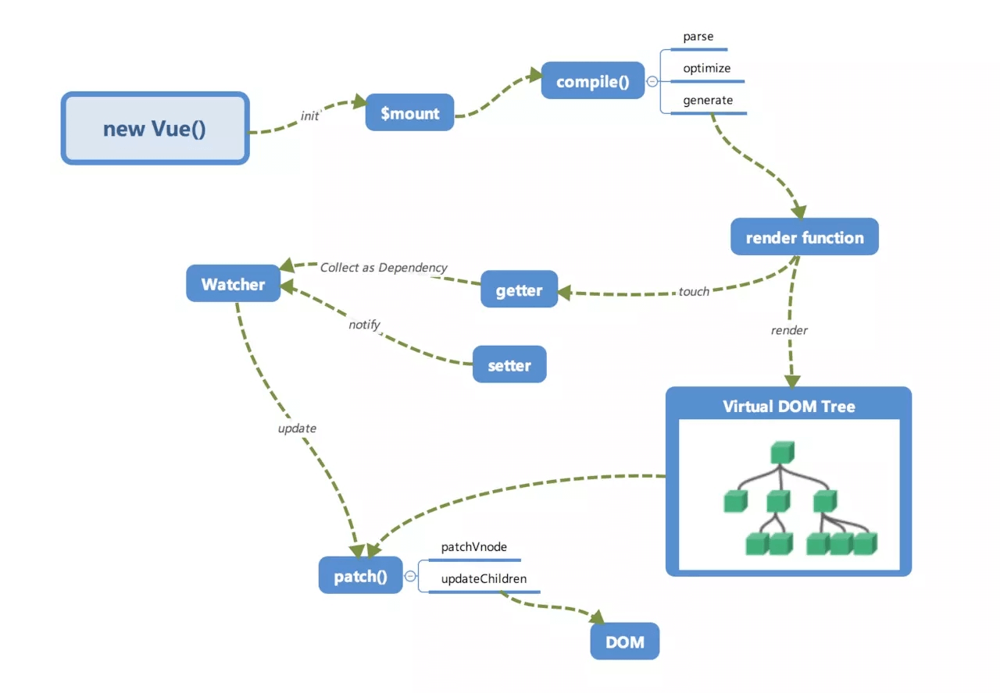

## 何为 Vue 的响应式？

&emsp;&emsp;当我们修改数据的时候，视图上相应位置就可以获得相应更新，并不需要对 DOM 进行操作。

## Vue 响应式原理

&emsp;&emsp;实现一个响应式大概可以分为三步：

1. **数据劫持**:当数据发生变化的时候，进行一些操作。
2. **依赖收集**:DOM 依赖了哪些数据。
3. **派发更新**:数据发生改变后，通知依赖该数据的 DOM 进行更新。



### **数据劫持**

&emsp;&emsp;Vue 在`init`的时候会通过[object.defineProperty](https://developer.mozilla.org/zh-CN/docs/Web/JavaScript/Reference/Global_Objects/Object/defineProperty)进行绑定，这使得被设置的对象在被读取的时候会执行`getter`函数，而在被赋值的时候执行`setter`函数。这个过程被称为数据劫持。

```javascript
// 数据劫持
function defineReactive(obj, key, val = obj[key]) {
  observe(val);
  Object.defineProperty(obj, key, {
    get: function defineGetter() {
      console.log("get : " + val);
      return val;
    },
    set: function defineSetter(newVal) {
      if (newVal === val) return;
      console.log(`${obj}中的${val} 修改为 ${newVal}`);
      val = newVal;
      observe(newVal);
    },
  });
}

class Observer {
  constructor(val) {
    this.val = val;
    this.walk();
  }
  walk() {
    Object.keys(this.val).forEach((key) => defineReactive(this.val, key));
  }
}

function observe(val) {
  if (typeof val !== "object" || !val) return;
  new Observer(val);
}

class Vue {
  constructor(options) {
    this._data = options.data;
    observe(this._data);
  }
}

const o = new Vue({
  data: {
    msg: "这里是Vue响应式",
    count: 0,
  },
});

o._data.count++; //...0修改为1
```

&emsp;&emsp;通过`object.defineProperty`我们可以轻易在数据发生变化的时候进行自己想要的操作。当`Vue`的`render function`被渲染时，需要读取对象的值，所以会触发`getter`函数去进行**依赖收集**，修改对象的值的时候，会触发对应的`setter`进行**派发更新**。

### **依赖收集&派发更新**

&emsp;&emsp;目的：某些数据发生了变化，然而视图里的`DOM`并没有依赖此数据，这个时候应该不需要进行视图更新。

&emsp;&emsp;举个简单的 🌰：

```javascript
new Vue({
  template: `<div>
            <span>{{text1}}</span> 
            <span>{{text2}}</span> 
        <div>`,
  data: {
    text1: "text1",
    text2: "text2",
    text3: "text3",
  },
});
```

&emsp;&emsp;假设我们让`data`中的`text3`发生了改变, `this.text3 = text3 modify`，这个时候我们发现视图里并不需要用到`text3`，所以并不需要触发视图更新，所以**依赖收集**是很有必要的。那我们怎么去进行**依赖收集**呢？

&emsp;&emsp;几个关键词： <span style="background:yellow;padding:2px;border-radius:5px;">Wathcher</span>&emsp;&emsp;<span style="background:yellow;padding:2px;border-radius:5px;">Dep</span>&emsp;&emsp;<span style="background:yellow;padding:2px;border-radius:5px;">发布--订阅模式</span>

#### **观察者 Watcher**

&emsp;&emsp;在`Vue`中有一个抽象的类`Wathcer`，每个`Watcher`的实例都会订阅一个或者多个数据，这些数据被称为该实例的依赖，当这些依赖发生变化的时候， `Wathcer`实例会接收到数据发生变化这条消息，从而进行数据更新。

&emsp;&emsp;🌰： 比如说当前有

`watcher1`订阅了`msg1`

`watcher2` 订阅了`msg2`

`watcher3`订阅了`msg1, msg2`

&emsp;&emsp;然后当 msg1 发生了改变的时候， `wathcher1和wathcer2`就会收到依赖发生变化的消息，从而进行视图更新。`watcher2`的依赖`msg2`没有发生变化，该观察者实例下的`Dom`相应的也不会进行更新。

```javascript
class Watcher {
  constructor() {
    /* 在 new 一个 Watcher 对象时将该对象赋值给 Dep.target，在 get 中会用到 */
    Dep.target = this;
  } /* 更新视图的方法 */
  update() {
    console.log("视图更新啦～");
  }
}
Dep.target = null;
```

#### 订阅者 Dep

&emsp;&emsp;用来存放`Wathcer`实例，会同时存在多个`Watcher`实例。

```javascript
class Dep {
  constructor() {
    /* 用来存放 Watcher 对象的数组 */
    this.subs = [];
  } /* 在 subs 中添加一个 Watcher 对象 */
  addSub(sub) {
    this.subs.push(sub);
  } /* 通知所有 Watcher 对象更新视图 */
  notify() {
    this.subs.forEach((sub) => {
      sub.update();
    });
  }
}
```

&emsp;&emsp;该类实现了两件事情：

1. 用 `addSub `方法可以在目前的 `Dep `对象中增加一个 `Watcher `的订阅操作；
2. 用 `notify `方法通知目前 `Dep `对象的 `subs `中的所有 `Watcher `对象触发更新操作。

## 总结

&emsp;&emsp;在`observer`的过程中，会注册`get`方法，该方法用来进行**依赖收集**。在它的闭包中有一个`Dep`对象，这个对象用来存放`Wathcer`对象的实例。当 `render function`进行渲染的时候，就会触发`get`方法，其中依赖的对象都会被读取， 然后通过`set`来更新视图（触发`dep`中的`notify`方法）。

```javascript
function defineReactive(obj, key, val) {
  /* 一个 Dep 类对象 */
  const dep = new Dep();
  Object.defineProperty(obj, key, {
    enumerable: true,
    configurable: true,
    get: function reactiveGetter() {
      /* 将 Dep.target（即当前的 Watcher 对象存入 dep 的 subs 中） */
      dep.addSub(Dep.target);
      return val;
    },
    set: function reactiveSetter(newVal) {
      if (newVal === val)
        return; /* 在 set 的时候触发 dep 的 notify 来通知所有的 Watcher 对象更新视图 */
      dep.notify();
    },
  });
}
class Vue {
  constructor(options) {
    this._data = options.data;
    observer(
      this._data
    ); /* 新建一个 Watcher 观察者对象，这时候 Dep.target 会指向这个 Watcher 对象 */
    new Watcher(); /* 在这里模拟 render 的过程，为了触发 test 属性的 get 函数 */
    console.log("render~", this._data.test);
  }
}
```
#### 重温一下图
